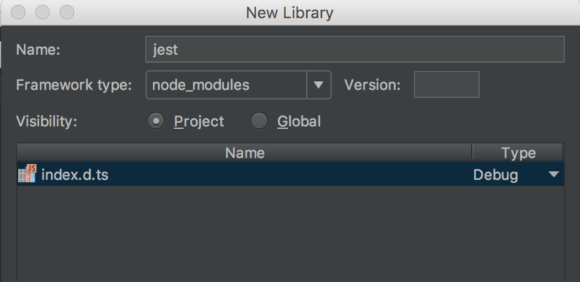
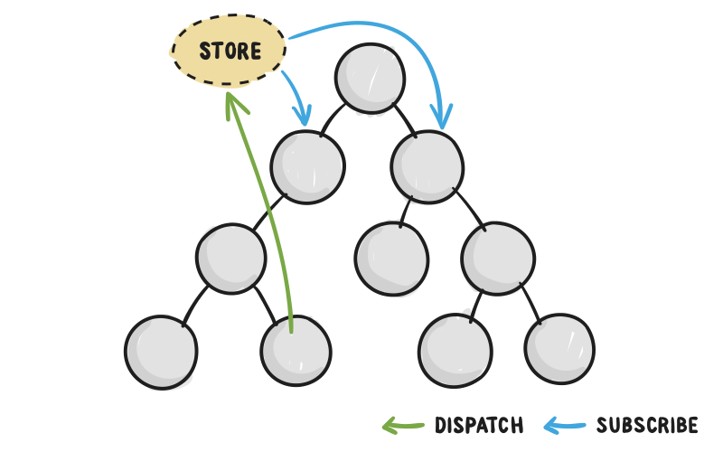
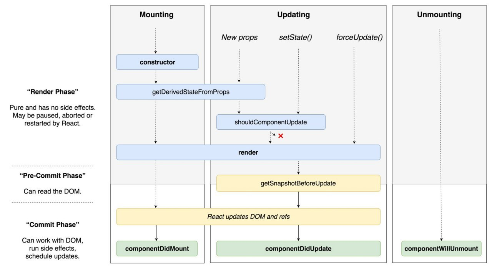

Learn ReactJS + JSX
===

## To Start Project 
`npm start` - Runs the app in the development mode. Open [http://localhost:3000](http://localhost:3000) to view it in the browser.

## WebStorm

### Add Syntax Highlighting in the Editor by Jest
1. `npm install @types/jest` - saved in local node modules
2. Now it needs to be added in Webstorm 
`Webstorm` -> `Preferences` -> `Languages & Frameworks` -> `JavaScript` -> `Libraries` 
Add...                    
Name: jest                
Visibility: Project       
Attach files: Cmd+Shift+G and type /usr/local/lib/node_modules. Open @types, jest and choose index.d.ts.  
You will have something like this:   

3. After `Apply` and `OK`

## Testing

### Test Utilities

[**Jest**](https://facebook.github.io/jest/) - Test Runner (executes test and provides validation libraries)
[**Enzyme**](http://airbnb.io/enzyme/docs/api/) - Testing Utilities ("Simulates" the React App (mounts components, allows you to dig into the DOM))

### Redux

### LifeCycle in React 16.3

